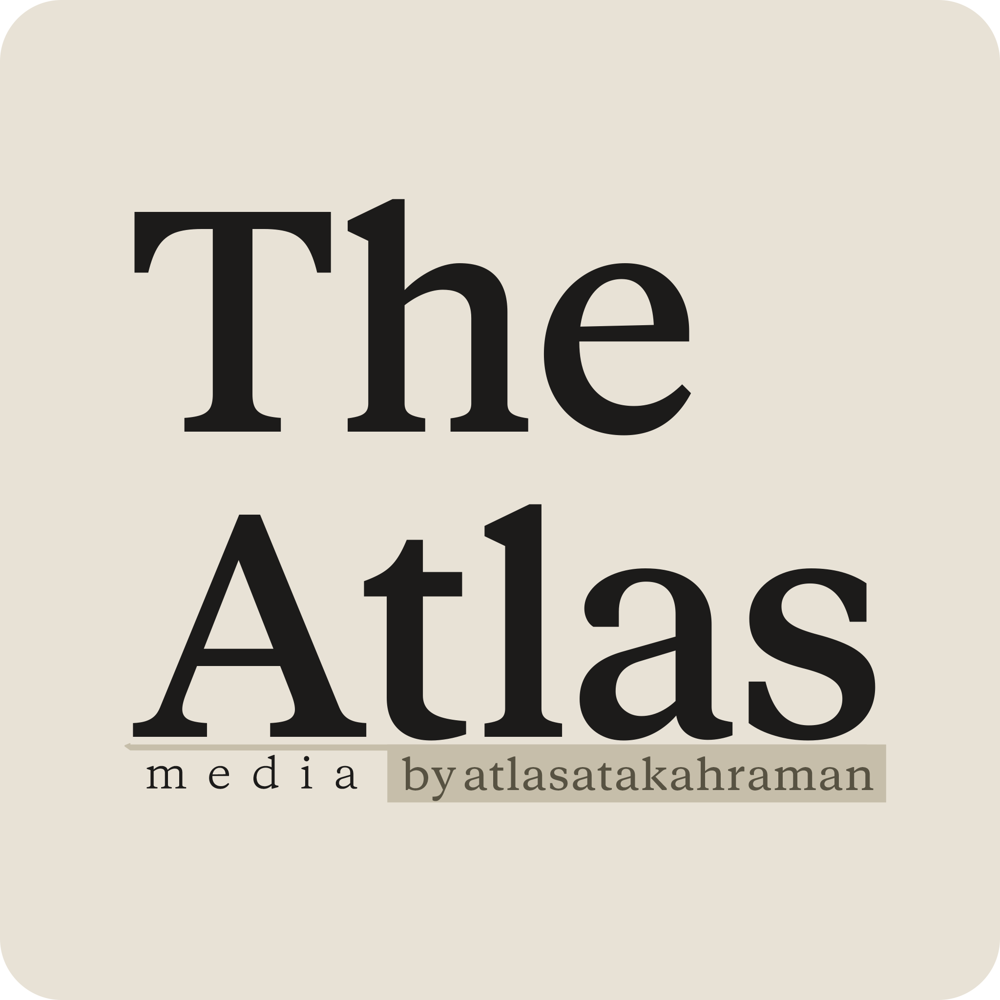

<p align="center">
  
  
  
  
  
  
  
</p>

<p align="center">
  
</p>

<h1 align="center">TheAtlas — Media</h1>

> **<p align="center">A high-performance cross-platform desktop application for downloading, extracting, and converting media — built with Next.js, TypeScript, and a Rust-powered Tauri backend.** </p>

---

## ✨ Overview

TheAtlas Media is a modern desktop application built on Next.js 16, TypeScript, and Tauri 2.11, with a Rust backend. It is the dedicated media-processing counterpart to the broader TheAtlas project, focused exclusively on high-performance video and audio workflows on the user's own machine.

The project focuses on delivering:
- Clean and modern **UI/UX** with dark theme support
- High-performance **native cross-platform** capabilities
- Automated **dependency management** with sha256 checksum integrity verification
- Powerful **video and audio downloading** & format conversion
- **Local-first** processing with no telemetry

---

## 🧠 Key Features

- 🖥️ **Cross-platform desktop application** (Windows · macOS · Linux)
- 🎨 **Modern UI/UX** powered by Next.js + shadcn/ui with dark theme support & header theme switcher
- 📦 **Automated Dependency Management** — Status detection, progress tracking, and sha256 checksum integrity verification for `yt-dlp` & `FFmpeg`/`FFprobe`
- 🧹 **Storage & Cache Control** — Live app storage tracking and one-click application cache clearing
- 🎞️ **Video downloading & format conversion**
- 🎵 **Audio extraction & metadata tagging**
- 🔐 **Local-first & privacy-focused** architecture
- 🦀 **Rust-powered backend** for performance and safety
- 🐧 **Linux & Arch Packaging** — Dedicated Linux and Arch Linux (`PKGBUILD`) build scripts

---

## 🧩 Technology Stack

### Frontend & Runtime
- **Next.js 16.2** (App Router, Turbopack, static export)
- **React 19**
- **TypeScript 6.0**
- **Tailwind CSS v4** + **shadcn/ui** + **next-themes** + **Sonner**
- **Package Manager:** Bun 1.4+ (mandatory execution engine)

### Backend
- **Rust 1.97+** (pinned toolchain)
- **Tauri 2.11** with custom IPC handlers (`dependency`, `install`, `update`, `model`)
- **tokio** async runtime + **reqwest** for async HTTP downloading
- **sha2** for sha256 binary checksum integrity verification
- **tar** / **xz2** / **zip** for archive extraction

### Media Processing
- **yt-dlp** & **FFmpeg / FFprobe** (managed locally or system-wide with sha256 integrity validation)
- **lofty** for audio metadata tagging

---

## ⚡ Commands & Development

```bash
# Run desktop app in development mode
bun run dev

# Run frontend dev server only
bun run next:dev

# Typecheck and lint codebase
bun run lint
bash scripts/check-compat.sh

# Build packages
bun run build:linux   # Generic Linux build script
bun run build:arch    # Arch Linux PKGBUILD package build script
```

---

## 🔒 Privacy & Security

- No telemetry
- No analytics
- No background data collection
- All data is stored locally on the user's device

> A formal privacy policy will accompany the first public release.

---

## 📦 Installation & Packaging

- **Arch Linux**: `bun run build:arch` (generates Arch package via `packaging/arch/PKGBUILD`)
- **Generic Linux**: `bun run build:linux` (runs Linux build script with cache handling)

> 🚧 Full pre-built releases will be made available as the project matures.

---

## 🛠️ Development Status

TheAtlas Media is under **active development**.

Phase 0 (scaffolding, governance, CI) is complete. Phase 1 (Dependency Manager Rust IPC backend, sha256 checksum manifest integrity verification, WebKit cache controls, and frontend settings page) is complete. Phase 2 (Media processing workflows & download manager UI integration) is in progress.

Features, APIs, and internal architecture may change as the project evolves toward its first public release.

---

## 📚 Legal

- **Application Name:** TheAtlas Media
- **Copyright:** © Atlas Ata KAHRAMAN
- **Alias:** atlasfirarda
- **License:** [AAKNCL v1.0](./LICENSE.md) (Non-Commercial)

Personal, educational, and non-commercial use is free. Commercial use requires a separate commercial license — see [LICENSE.md](./LICENSE.md).

Unauthorized commercial use, sublicensing, or trademark abuse of "TheAtlas", "TheAtlas Media", or the project's logos is strictly prohibited.

---

## 📧 Contact

For technical, legal, or commercial-licensing inquiries:

- **Developer:** Atlas Ata KAHRAMAN
- **Alias:** atlasfirarda
- **Email:** atlasatakahraman.com@gmail.com
- **GitHub:** https://github.com/atlasatakahraman

---

⭐ If you find this project interesting, consider starring the repository.
