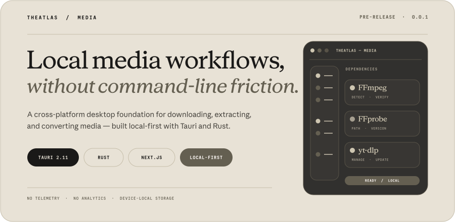
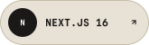
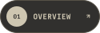
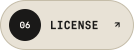
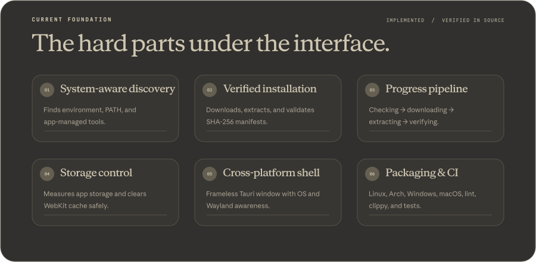
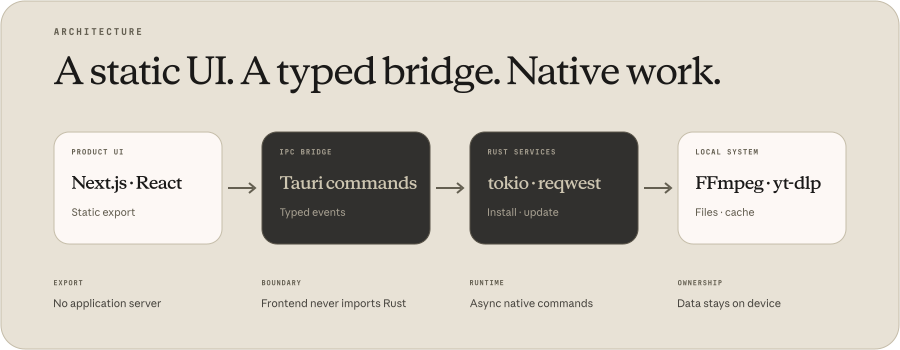
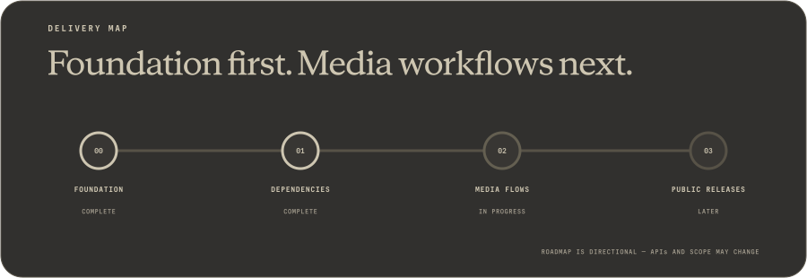

<!--
  TheAtlas Media README
  Display typography is converted to vector outlines inside local SVG assets.
  No external fonts, scripts, or image services are required.
-->

<p align="center">
  
</p>

<p align="center">
  <a href="https://github.com/atlasatakahraman/TheAtlas-Media"></a>&nbsp;
  <a href="./package.json"></a>&nbsp;
  <a href="https://v2.tauri.app/"></a>&nbsp;
  <a href="https://nextjs.org/"></a>&nbsp;
  <a href="https://www.rust-lang.org/"></a>&nbsp;
  <a href="https://bun.sh/"></a>&nbsp;
  <a href="./LICENSE.md"></a>
</p>

<p align="center">
  <a href="#overview"></a>&nbsp;
  <a href="#current-foundation"></a>&nbsp;
  <a href="#architecture"></a>&nbsp;
  <a href="#development"></a>&nbsp;
  <a href="#roadmap"></a>&nbsp;
  <a href="#license"></a>
</p>

> [!IMPORTANT]
> **TheAtlas Media is an active pre-release project.** The desktop shell and dependency-management foundation are implemented; the end-user media workflows are still being built. There are currently no published binary releases.

<a id="overview"></a>
## Overview

**TheAtlas Media** is a cross-platform desktop project for downloading, inspecting, extracting, and converting video and audio without exposing users to a wall of command-line flags.

The application pairs a statically exported **Next.js 16** interface with a **Tauri 2** desktop shell and an asynchronous **Rust** backend. The long-term product direction is a focused, native-feeling workspace around `yt-dlp`, `FFmpeg`, and `FFprobe`; the current repository concentrates on the infrastructure that makes those workflows dependable: discovering tools, managing binaries, reporting progress, validating checksums, understanding the host system, and controlling local storage.

### Product principles

- **Local by default.** Media, settings, caches, and generated files stay on the user’s device.
- **Clear over clever.** Presets and guided flows should replace raw flag memorization.
- **Native where it matters.** Downloads, archives, process execution, filesystem work, and integrity checks belong in Rust.
- **Honest about state.** Missing tools, versions, source paths, download size, verification, and failures are visible in the interface.
- **Cross-platform deliberately.** Windows, macOS, Linux, Wayland, packaging, and CI are treated as first-class constraints.

<a id="current-foundation"></a>
<p align="center">
  
</p>

### Implemented now

| Area | Current capability |
|---|---|
| **Desktop shell** | Frameless Tauri window, custom header/sidebar, theme switching, OS detection, and Linux display-server awareness |
| **Dependency discovery** | Detects `FFmpeg`, `FFprobe`, and `yt-dlp` from environment overrides, app-managed storage, or system `PATH` |
| **Dependency lifecycle** | Install, install-all, uninstall, version checks, update checks, download-size lookup, and event-driven progress |
| **Integrity** | SHA-256 manifest and binary verification before a managed dependency is treated as ready |
| **Storage** | Application-storage measurement, WebKit cache measurement, and explicit cache clearing |
| **Packaging** | Tauri bundles, generic Linux build wrapper, Arch Linux `PKGBUILD`, and NSIS configuration for Windows |
| **Quality gates** | TypeScript, ESLint, compatibility rules, agent/animation checks, rustfmt, clippy, Cargo check, and tests across three CI operating systems |

### In progress

The media-facing layer is the current workstream: connecting the existing navigation and route structure to real Rust commands for downloads, extraction, conversion, queues, progress, cancellation, and output handling.

The sidebar already maps the intended product surface—single videos, playlists, channels, audio, subtitles, thumbnails, format inspection, codec selection, transcoding, batch conversion, NLE presets, trimming, audio processing, and image/frame tools. **That map describes direction, not a list of completed features.**

<a id="architecture"></a>
<p align="center">
  
</p>

### Runtime boundaries

1. **Product UI** — Next.js App Router, React 19, TypeScript, Tailwind CSS v4, shadcn/ui, and a static export.
2. **IPC bridge** — typed Tauri commands and events connect the webview to native capabilities.
3. **Rust services** — `tokio`, `reqwest`, archive readers, checksum validation, process execution, and filesystem operations.
4. **Local system** — app-managed or system installations of `FFmpeg`, `FFprobe`, and `yt-dlp`, plus local files and caches.

The frontend has no application server. Production output is exported to `out/` and loaded by Tauri; native work crosses the IPC boundary instead of being hidden inside browser-only abstractions.

### Repository map

```text
src/app/                         Next.js routes and static application entry points
src/app/settings/dependencies/   Dependency manager interface
src/components/                  Product components and shadcn/ui primitives
src/hooks/                       Dependency, installation, window, and system state
src/layout/                      Frameless header, sidebar, navigation, and app view
src/lib/                         Shared contracts, environment helpers, and utilities
src-tauri/src/commands/          Native dependency, install, update, and model commands
src-tauri/src/lib.rs             Tauri setup, plugins, OS/display detection, IPC registry
packaging/arch/                  Arch package metadata
scripts/                         Compatibility checks and Linux/Arch build wrappers
.github/workflows/               CI, security audit, licensing, and automation
```

<a id="development"></a>
## Development

### Prerequisites

- **Bun 1.4+** — mandatory package manager and script runtime
- **Node.js 20.9+** — required by Next.js compatibility checks
- **Rust 1.97.1** — pinned in `rust-toolchain.toml` with `rustfmt` and `clippy`
- **ripgrep** — used by repository guard scripts
- **Tauri system dependencies** for your operating system

On Debian/Ubuntu-based Linux systems, the CI environment installs:

```bash
sudo apt-get install -y \
  libgtk-3-dev \
  libwebkit2gtk-4.1-dev \
  libayatana-appindicator3-dev \
  librsvg2-dev \
  build-essential
```

### Start locally

```bash
git clone https://github.com/atlasatakahraman/TheAtlas-Media.git
cd TheAtlas-Media

bun install --frozen-lockfile
bun run dev
```

For the frontend without the desktop shell:

```bash
bun run next:dev
```

### Build

```bash
bun run build          # Standard Tauri build
bun run build:linux    # Linux wrapper for AppImage/deb/rpm tooling
bun run build:arch     # Arch package through packaging/arch/PKGBUILD
```

No production installers are published yet. Build output and bundle availability depend on the host operating system and installed Tauri prerequisites.

### Quality checks

```bash
bun run lint
bun tsc --noEmit
bash scripts/check-agents-rules.sh
bash scripts/check-animation-rules.sh
bash scripts/check-compat.sh

cd src-tauri
cargo fmt --check
cargo clippy --all-targets -- -D warnings
cargo check --no-default-features
cargo test --no-default-features
```

### Project constraints

- Static Next.js export only; there is no server runtime.
- Tauri v2 APIs only.
- Bun is the execution engine for JavaScript tooling.
- Frontend code does not import Rust source directly; native features go through IPC.
- Interface animation is restricted to GPU-friendly `transform` and `opacity` patterns.
- New application/layout files follow the repository’s Next.js verification stamp convention.

<a id="roadmap"></a>
<p align="center">
  
</p>

### Directional milestones

- **Foundation — complete:** repository governance, static-export shell, native runtime, CI, and build structure.
- **Dependency system — complete:** discovery, managed installation, progress, integrity verification, updates, and cache controls.
- **Media workflows — in progress:** real download/extract/convert commands, queue orchestration, cancellation, and output UX.
- **Public releases — later:** signed or packaged binaries, installation guidance, privacy documentation, and stabilized APIs.

The roadmap is intentionally directional. Features, route names, native contracts, and release scope may change while the application is pre-release.

## Privacy and security

- No telemetry or behavioral analytics are implemented.
- Application data and generated media remain local unless a workflow explicitly contacts a remote media source.
- Dependency installation and media retrieval require network access.
- The app performs a background update check during startup; this is an update request, not usage tracking.
- Managed dependency downloads are checked against SHA-256 data before they are accepted.
- Tauri uses a restrictive content-security policy and explicit capabilities.
- Cache clearing is user-triggered and reports storage before deletion.

## Third-party tools

TheAtlas Media coordinates established media tools rather than replacing them:

- [`FFmpeg`](https://ffmpeg.org/) and `FFprobe` — multimedia processing and inspection
- [`yt-dlp`](https://github.com/yt-dlp/yt-dlp) — media and metadata extraction

Each dependency retains its own authorship, license, and distribution terms. The application’s license does not supersede third-party licenses.

## Contributing

The project is currently maintainer-led while architecture and native contracts are still moving. Focused bug reports and implementation discussions are welcome through [GitHub Issues](https://github.com/atlasatakahraman/TheAtlas-Media/issues).

Before proposing code, run the relevant TypeScript, repository-rule, and Rust checks listed above. Keep Rust/native changes and frontend/product changes separated where practical.

<a id="license"></a>
## License

TheAtlas Media is distributed under the **[AAKNCL v1.0](./LICENSE.md)** non-commercial license.

- Personal, educational, and non-commercial use is permitted under the license terms.
- Commercial use requires a separate agreement.
- TheAtlas names, product identity, and logos are not granted for unauthorized commercial use or misleading redistribution.

For technical, legal, or commercial-license inquiries:

- **Developer:** Atlas Ata Kahraman
- **GitHub:** [@atlasatakahraman](https://github.com/atlasatakahraman)
- **Email:** [atlasatakahraman.com@gmail.com](mailto:atlasatakahraman.com@gmail.com)

<p align="center">
  <sub>Designed at the interface. Engineered at the boundary. Processed on your machine.</sub>
</p>
