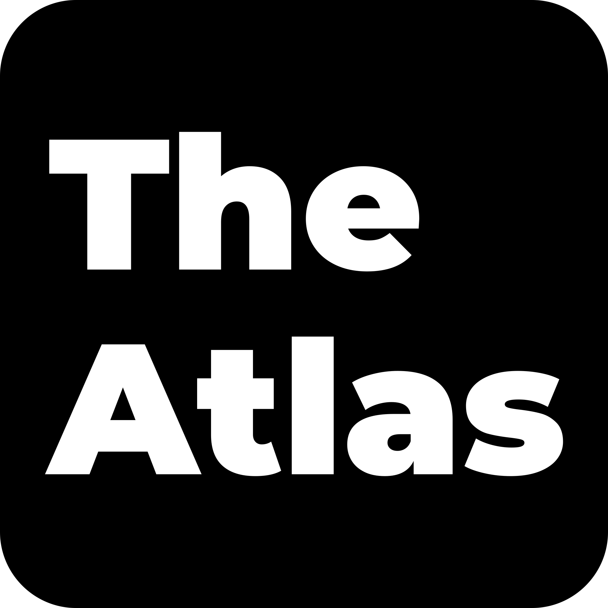

  
  
  
  
  
  

  

<h1 align="center">TheAtlas — Media</h1>

> **
A high-performance cross-platform desktop application for downloading, extracting, and converting media — built with Next.js, TypeScript, and a Rust-powered Tauri backend.** 

---

## ✨ Overview

TheAtlas Media is a modern desktop application built on Next.js, TypeScript, and Tauri 2.x, with a Rust backend. It is the dedicated media-processing counterpart to the broader TheAtlas project, focused exclusively on high-performance video and audio workflows on the user's own machine.

The project focuses on delivering:
- Clean and modern **UI/UX**
- High-performance **native cross-platform** capabilities
- Powerful **video and audio downloading**
- Efficient **media extraction and conversion**
- **Local-first** processing with no telemetry

---

## 🧠 Key Features

- 🖥️ **Cross-platform desktop application** (Windows · macOS · Linux)
- 🎨 **Modern UI/UX** powered by Next.js + shadcn/ui
- 🎞️ **Video downloading & format conversion**
- 🎵 **Audio extraction & metadata tagging**
- 🔐 **Local-first & privacy-focused** architecture
- 🦀 **Rust-powered backend** for performance and safety
- ⚡ **Native parallel-segment downloads** (no slow CLI wrapper)
- 🧩 **Format presets** instead of raw flags — safer and simpler

---

## 🧩 Technology Stack

### Frontend
- **Next.js 16** (App Router, Turbopack)
- **TypeScript**
- **shadcn/ui** + **Tailwind CSS v4**

### Backend
- **Rust 1.89+**
- **Tauri 2.x**
- **boul2gom yt-dlp** Rust crate (managed binaries, native HTTP)

### Media Processing
- **FFmpeg** (managed automatically by the yt-dlp crate)
- **lofty** for audio metadata tagging

---

## 🔒 Privacy & Security

- No telemetry
- No analytics
- No background data collection
- All data is stored locally on the user's device

> A formal privacy policy will accompany the first public release.

---

## 📦 Installation

> 🚧 Installation instructions will be added as the project matures. Track progress in the [CHANGELOG](./documentation/CHANGELOG.md).

---

## 🛠️ Development Status

TheAtlas Media is under **active development**.

Phase 0 (scaffolding, governance, CI) is complete. Phase 1 (Rust backend extractor + IPC contracts) is in progress.

Features, APIs, and internal architecture may change as the project evolves toward its first public release.

---

## 📚 Legal

- **Application Name:** TheAtlas Media
- **Copyright:** © Atlas Ata KAHRAMAN
- **Alias:** atlasfirarda
- **License:** [AAKNCL v1.0](./LICENSE.md) (Non-Commercial)

Personal, educational, and non-commercial use is free. Commercial use requires a separate commercial license — see [LICENSE.md](./LICENSE.md).

Unauthorized commercial use, sublicensing, or trademark abuse of "TheAtlas", "TheAtlas Media", or the project's logos is strictly prohibited.

---

## 📧 Contact

For technical, legal, or commercial-licensing inquiries:

- **Developer:** Atlas Ata KAHRAMAN
- **Alias:** atlasfirarda
- **Email:** atlasatakahraman.com@gmail.com
- **GitHub:** https://github.com/atlasatakahraman

---

⭐ If you find this project interesting, consider starring the repository.
